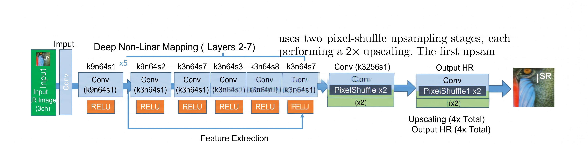
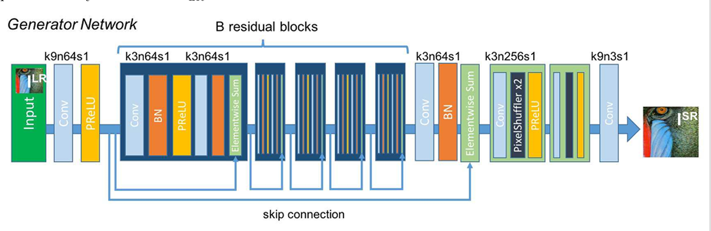
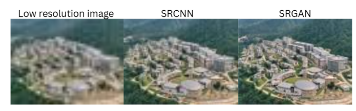

# Image Super-Resolution Using CNN and GAN

A Deep Learning Approach to 4× Image Upscaling Using SRCNN and SRGAN

## 1. Project Overview

Image Super-Resolution (SR) is a computer vision task that reconstructs a high-resolution (HR) image from a low-resolution (LR) input image.

This project implements and compares two deep learning approaches:

- **SRCNN (Super-Resolution Convolutional Neural Network):** Focuses on pixel-level image reconstruction using convolutional layers and reconstruction loss.
- **SRGAN (Super-Resolution Generative Adversarial Network):** Focuses on perceptual quality and realistic texture reconstruction using adversarial training.

The objective is to compare reconstruction-based and GAN-based super-resolution techniques in terms of image sharpness, structural preservation, and perceptual quality.

**Upscaling factor:** 4×  
**Input resolution:** 22 × 22 pixels  
**Output resolution:** 88 × 88 pixels

## 2. Key Features

- 4× image super-resolution using deep learning.
- CNN-based reconstruction using SRCNN.
- GAN-based perceptual enhancement using SRGAN.
- Separate CNN and GAN processing pipelines.
- Side-by-side comparison of low-resolution inputs and generated outputs.
- Pretrained model inference on user-uploaded images.
- Visualization and saving of super-resolved images.

## 3. Model Architectures

### 3.1 SRCNN — CNN-Based Super-Resolution

SRCNN learns a mapping between low-resolution image information and high-resolution image details using convolutional layers.

**Workflow:**

1. Input a low-resolution image.
2. Extract relevant image features using convolutional layers.
3. Learn nonlinear mappings between image features.
4. Reconstruct the high-resolution output.
5. Optimize the model using a pixel-level reconstruction loss.

**Characteristics:**
- Emphasizes pixel-level accuracy.
- Produces stable and consistent reconstructions.
- Can generate smooth outputs when fine details are difficult to recover.
- Does not explicitly optimize for realistic texture generation.

### 3.2 SRGAN — GAN-Based Super-Resolution

SRGAN uses two neural networks trained adversarially to produce visually convincing high-resolution images.

**Generator:**
- Takes a low-resolution image as input.
- Extracts features through convolutional and residual blocks.
- Upsamples the feature maps.
- Generates a high-resolution image.

**Discriminator:**
- Receives real high-resolution images and generated images.
- Learns to distinguish real images from generated images.
- Provides adversarial feedback to improve the generator.

**Training objective:**

The generator is optimized using content-related and adversarial objectives. Depending on the implementation, perceptual loss may also be used.

**Characteristics:**
- Encourages sharper textures and edges.
- Can produce more perceptually realistic images.
- May introduce plausible details that are not present in the original image.
- Requires careful training to balance visual realism and fidelity to the input.

## 4. Model Pipelines

This project uses separate pipelines for CNN-based reconstruction and GAN-based super-resolution.

### 4.1 CNN Pipeline (`CNN_PIPE`)



The CNN pipeline illustrates the image reconstruction process using a convolutional neural network.

**Pipeline stages:**

1. **Low-Resolution Input:** The model receives a low-resolution image.
2. **Feature Extraction:** Convolutional layers identify features such as edges, shapes, and local patterns.
3. **Feature Mapping:** The network learns relationships between the extracted features and high-resolution image representations.
4. **Image Reconstruction:** The model generates a reconstructed high-resolution image.
5. **Output Evaluation:** The generated image can be compared with the ground-truth high-resolution image.

**Training objective:** Minimize reconstruction error, such as Mean Squared Error (MSE), between the predicted and target high-resolution images.

**Expected behavior:** The model prioritizes pixel-level similarity and may produce smoother textures.

### 4.2 GAN Pipeline (`GAN_PIPE`)



The GAN pipeline illustrates the generator-discriminator framework used for perceptual super-resolution.

**Pipeline stages:**

1. **Low-Resolution Input:** A low-resolution image is passed to the generator.
2. **Feature Extraction:** The generator extracts features through convolutional and residual blocks.
3. **Upsampling:** Intermediate feature maps are upscaled to the target resolution.
4. **High-Resolution Generation:** The generator produces a super-resolved image.
5. **Discriminator Evaluation:** The discriminator compares real high-resolution images with generated images.
6. **Adversarial Feedback:** The discriminator's feedback encourages the generator to create more realistic outputs.
7. **Model Optimization:** The networks are updated during training according to their respective objectives.

**Training objective:** Combine adversarial learning with a content or reconstruction objective. A perceptual loss may also be included, depending on the implementation.

**Expected behavior:** The generator aims to create sharper and more realistic textures while preserving the overall image structure.

> **Important:** The discriminator is primarily used during training. During inference with a pretrained SRGAN generator, the low-resolution image is passed through the generator to obtain the super-resolved output.

## 5. CNN vs. GAN Comparison

| Aspect | SRCNN | SRGAN |
|---|---|---|
| Main objective | Pixel-level reconstruction | Perceptual realism |
| Core architecture | Convolutional neural network | Generator and discriminator |
| Training approach | Reconstruction loss | Adversarial and content-related losses |
| Image appearance | Often smoother | Often sharper and more textured |
| Texture generation | Limited by reconstruction objective | Can generate plausible fine details |
| Main trade-off | May look overly smooth | May introduce details that are not faithful to the original |

Neither approach is universally superior. The best model depends on whether the priority is pixel-level fidelity or perceptual realism.

## 6. Results and Visual Comparison

The models are evaluated using 4× upscaling, converting 22 × 22 pixel images into 88 × 88 pixel outputs.

### CNN Results

The CNN model reconstructs the overall image structure and improves spatial resolution. However, fine textures may appear smooth because pixel-based losses favor average-valued predictions when the original details are uncertain.

### GAN Results

The GAN model aims to produce more visually convincing edges and textures. Adversarial training encourages realistic-looking outputs, although generated details are not guaranteed to match the original image exactly.

### Visual Evaluation

Compare the following:
- Low-resolution input image.
- SRCNN reconstructed output.
- SRGAN generated output.
- Ground-truth high-resolution image, where available.

For quantitative evaluation, PSNR and SSIM can measure reconstruction fidelity, while perceptual metrics can help assess visual similarity. Report metric values only after evaluating the trained models on a consistent test set.

### 6.1 Real-World Example: College Image Super-Resolution

The following example demonstrates the application of the trained super-resolution model to a low-resolution image of our college.



**Objective:** Enhance a low-resolution college image to improve its visual clarity and reveal finer details.

**What this demonstrates:**
- Application of the trained model to a real-world image.
- 4× image upscaling to generate a higher-resolution output.
- Visual enhancement of edges, structures, and image details.
- Practical use of deep learning for image enhancement.

This example illustrates how the super-resolution pipeline can be applied beyond the training dataset. The generated image may appear sharper, but the reconstructed details are model predictions and are not guaranteed to match the original scene perfectly.

## 7. Repository Structure

```text
IMAGE_RESOLUTION_BY_GAN/
│
├── SRGAN_CNN_TRAIN_CODE.ipynb
├── SRGAN_SRCNN_TEST_CODE.ipynb
├── Pre_trained_model.ipynb
│
├── cnn_final.pth
├── netG_final.pth
│
├── CNN_PIPE.png
├── GAN_PIPE.png
├── plot_cnn.jpeg
├── plot_sr.jpeg
│
└── README.md
```

**Notebook descriptions:**

- `SRGAN_CNN_TRAIN_CODE.ipynb` — Training notebook for the CNN/SRCNN and GAN/SRGAN models, as organized in this repository.
- `SRGAN_SRCNN_TEST_CODE.ipynb` — Testing and visual comparison of super-resolution outputs.
- `Pre_trained_model.ipynb` — Notebook for loading pretrained weights and performing image inference.
- `cnn_final.pth` — Saved CNN model weights.
- `netG_final.pth` — Saved SRGAN generator weights.
- `CNN_PIPE.png` — CNN reconstruction pipeline diagram.
- `GAN_PIPE.png` — GAN generator-discriminator pipeline diagram.
- `plot_cnn.jpeg` and `plot_sr.jpeg` — Result visualizations.

## 8. Dataset

The training dataset is available through Google Drive:

[Download the Dataset](https://drive.google.com/drive/folders/1K55R520-UMVgRQUR5ew6TE8Tfiz06XUw?usp=drive_link)

Download the dataset and place it in the directory expected by the training notebooks. Update the dataset path in the notebook if your local folder structure differs.

## 9. Installation and Setup

### Prerequisites

- Python 3.8 or higher
- pip
- Jupyter Notebook
- CPU or compatible GPU

### Step 1: Clone the Repository

```bash
git clone https://github.com/Prudhvisunku14/IMAGE_RESOLUTION_BY_GAN.git
cd IMAGE_RESOLUTION_BY_GAN
```

### Step 2: Install Dependencies

```bash
python -m pip install torch torchvision matplotlib pillow ipywidgets notebook
```

Use a PyTorch installation compatible with your operating system and CUDA version if GPU acceleration is required.

### Step 3: Launch Jupyter Notebook

```bash
jupyter notebook
```

### Step 4: Run the Pretrained Model

Open `Pre_trained_model.ipynb` and execute the notebook cells in order.

Follow the notebook's image-upload interface to provide an input image and generate the super-resolved result.

**Note:** The notebook must have access to the pretrained weights and any required supporting files. The upload widget and output-saving behavior depend on the notebook implementation.

## 10. Hardware Requirements

| Component | Requirement |
|---|---|
| Python | 3.8+ |
| Memory | 4 GB RAM minimum suggested |
| Processor | CPU supported |
| GPU | Optional; compatible GPU can accelerate inference and training |
| Storage | Sufficient space for dataset, notebooks, and model weights |

Actual training requirements depend on dataset size, batch size, model configuration, and available hardware.

## 7. Quantitative Evaluation Metrics

To evaluate the quality of the generated high-resolution images, two widely used image reconstruction metrics are considered: **Peak Signal-to-Noise Ratio (PSNR)** and **Structural Similarity Index Measure (SSIM)**.

Both metrics compare a super-resolved image against its corresponding ground-truth high-resolution image.


### 7.3 SRCNN vs. SRGAN: Metric Comparison

The following values are **illustrative estimates only**, provided to explain the expected trade-off between reconstruction accuracy and perceptual quality. They have not been experimentally measured for this project.

| Metric | SRCNN (CNN) | SRGAN |
|---|---:|---:|
| PSNR | ~28 dB | ~25 dB |
| SSIM | ~0.61 | ~0.81 |
| Reconstruction characteristics | Smoother, pixel-oriented | Sharper, potentially richer textures |

### 7.4 Results Interpretation

SRCNN typically emphasizes pixel-level reconstruction through a reconstruction loss, such as MSE. This can help it achieve higher PSNR and SSIM when evaluated against ground-truth images.

SRGAN uses adversarial training to encourage perceptually realistic image details. Some generated textures may differ from the reference image, potentially reducing PSNR and SSIM even when the result appears visually sharper.

Therefore, PSNR and SSIM should be considered alongside visual inspection. Neither metric alone fully captures human perception of image quality.

**Evaluation note:** A valid quantitative comparison requires corresponding ground-truth high-resolution images, consistent image ranges and color spaces, and the same test set for both models. Replace the illustrative values above with measured results before reporting them as experimental findings.

## Author

**Prudhvi Sunku**

GitHub: [@Prudhvisunku14](https://github.com/Prudhvisunku14)
